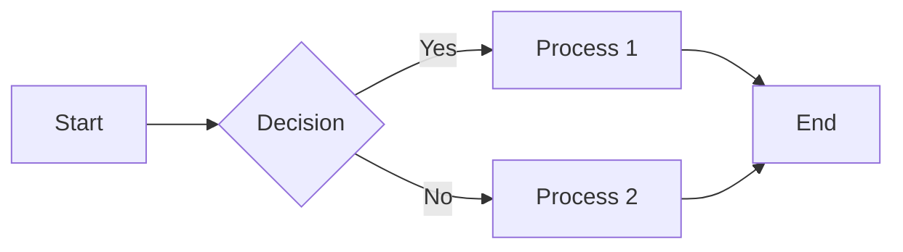

# Demos & Samples

Examples of presentations created with AutoSlideIdea.

## Sample Presentations

<a href="{{ site.baseurl }}/demos/sample-presentation/" class="btn btn-primary" target="_blank">
  View Sample Presentations →
</a>

### Included Samples

1. **Basic Example** - Simple presentation structure
2. **Business Proposal** - Corporate presentation sample
3. **Technical Presentation** - Engineering presentation example

## Template Gallery

Available templates:

### Business
- **business** - For business presentations
- **pitch** - For startup pitches
- **report** - For reports and documentation

### Technical
- **technical** - For technical presentations
- **academic** - For academic presentations
- **workshop** - For workshops and hands-on sessions

### General
- **basic** - Basic template
- **minimal** - Minimal design
- **modern** - Modern design

## Creation Examples

### Markdown Source

```markdown
---
marp: true
theme: default
paginate: true
---

# Presentation Title

Presenter Name
July 6, 2024

---

# Agenda

1. Introduction
2. Main Content
3. Summary

---

# Introduction

Content goes here...
```

### Generated Slides

The above Markdown generates beautifully formatted HTML presentations.

## Customization Examples

### Custom CSS

```css
/* theme/custom.css */
section {
  background: linear-gradient(to bottom right, #667eea 0%, #764ba2 100%);
  color: white;
}

h1 {
  color: #ffd89b;
  text-shadow: 2px 2px 4px rgba(0,0,0,0.3);
}
```

### Mermaid Diagrams

```markdown

```

## Related Pages

- [Basic Usage](../user-guide/basic-usage/)
- [Using Themes](../user-guide/themes/)
- [Template Reference](../reference/templates/)