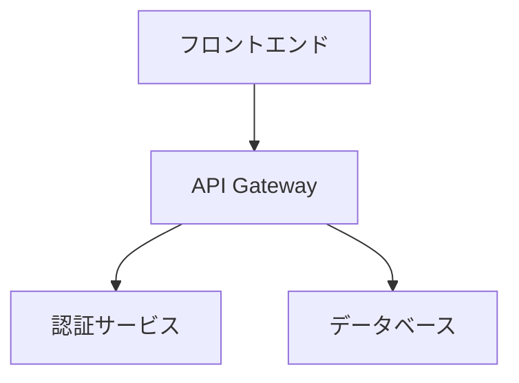
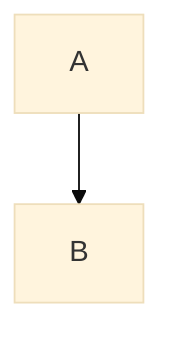

[English](mermaid.en.md) | 日本語

# Mermaid図表統合ガイド

## 概要

AutoSlideIdeaでは、Mermaid図表をMarpプレゼンテーションに統合するための包括的なソリューションを提供しています。Marpには現在Mermaidの直接的なサポートがありませんが、プリプロセッシング方式により、シームレスな統合を実現しています。

## クイックスタート

### 1. 環境準備
```bash
# Mermaid CLIのインストール（package.jsonに含まれています）
npm install
```

### 2. 基本的な使い方
```bash
# 単一ファイルの処理
./scripts/preprocess-mermaid.sh presentations/my-presentation/slides.md

# Marpでビルド
npm run pdf -- presentations/my-presentation/slides-processed.md
```

### 3. 複数ファイルの一括処理
```bash
./scripts/batch-preprocess-mermaid.sh presentations/**/*.md
```

## Mermaidコードの書き方

Markdownファイル内で、通常のMermaid記法を使用します：

```markdown
## システムアーキテクチャ


```

処理後、自動的にSVG画像に変換されます。

## 対応している図表タイプ

- **フローチャート** (graph/flowchart)
- **シーケンス図** (sequenceDiagram)
- **ガントチャート** (gantt)
- **クラス図** (classDiagram)
- **状態遷移図** (stateDiagram)
- **円グラフ** (pie)
- **ER図** (erDiagram)
- **ユーザージャーニー** (journey)

詳細な使用例は[デモプレゼンテーション](https://dobachi.github.io/AutoSlideIdea/)をご覧ください。

## GitHub Actions統合

### 自動ビルドの設定

1. ワークフローファイルをコピー：
```bash
cp templates/github-workflows/mermaid-enabled.yml .github/workflows/build-presentation.yml
```

2. コミット＆プッシュで自動実行：
- Mermaid図表の自動検出と処理
- 日本語フォント対応
- PDF/HTML/PPTXの自動生成
- GitHub Pages自動デプロイ

## 高度な使い方

### カスタムテーマの適用
```bash
# デフォルトテーマ
./scripts/preprocess-mermaid.sh -t default slides.md

# ダークテーマ
./scripts/preprocess-mermaid.sh -t dark slides.md
```

### 出力形式の指定
```bash
# PNG形式（印刷品質向上）
./scripts/preprocess-mermaid.sh -f png slides.md

# PDF形式（ベクター形式）
./scripts/preprocess-mermaid.sh -f pdf slides.md
```

### 画像サイズの調整
```bash
# 幅と高さを指定
./scripts/preprocess-mermaid.sh -w 800 -H 600 slides.md

# スケールで調整
./scripts/preprocess-mermaid.sh -s 2 slides.md
```

## トラブルシューティング

### 日本語が表示されない

GitHub Actions環境では自動的に日本語フォントがインストールされます。ローカル環境では：

```bash
# Ubuntu/Debian
sudo apt-get install fonts-noto-cjk

# macOS
brew install font-noto-sans-cjk
```

### Puppeteerエラー（CI環境）

CI環境でのサンドボックスエラーは自動的に処理されます。手動で設定する場合：

```json
// puppeteer-config.json
{
  "args": ["--no-sandbox", "--disable-setuid-sandbox"]
}
```

### 図表が大きすぎる/小さすぎる

1. Mermaidの設定で調整：


2. スクリプトオプションで調整：
```bash
./scripts/preprocess-mermaid.sh -s 1.5 slides.md  # 1.5倍に拡大
```

## スクリプトリファレンス

### preprocess-mermaid.sh

単一ファイルのMermaid図表を処理します。

**オプション：**
- `-t, --theme`: Mermaidテーマ (default/dark/forest/neutral)
- `-b, --background`: 背景色 (デフォルト: transparent)
- `-f, --format`: 出力形式 (svg/png/pdf)
- `-w, --width`: 画像の幅
- `-H, --height`: 画像の高さ
- `-s, --scale`: スケール係数
- `-c, --config`: カスタム設定ファイル
- `-o, --output`: 出力先ディレクトリ

### batch-preprocess-mermaid.sh

複数ファイルを一括処理します。

**オプション：**
- `-p, --preserve-structure`: ディレクトリ構造を保持
- `-d, --output-dir`: 出力先ディレクトリ
- `-n, --dry-run`: ドライランモード
- `--parallel`: 並列処理を有効化

## 実装の技術的詳細

### なぜプリプロセッシングが必要か

1. **Marpの制約**: SVG foreignObject内でのフォントサイズ検出の問題
2. **セキュリティ**: 動的なスクリプト実行を避ける
3. **パフォーマンス**: ビルド時に一度だけ処理
4. **互換性**: PDF/PPTXエクスポートでも正しく表示

### 処理フロー

1. Markdownファイル内のMermaidコードブロックを検出
2. 各ブロックを一時ファイルに抽出
3. Mermaid CLIで画像に変換
4. 元のコードブロックを画像参照に置換
5. 処理済みファイルを出力

## 関連リソース

- [Mermaid公式ドキュメント](https://mermaid.js.org/)
- [Marp公式ドキュメント](https://marp.app/)
- [デモプレゼンテーション](https://dobachi.github.io/AutoSlideIdea/)
- [GitHub - mermaid-cli](https://github.com/mermaid-js/mermaid-cli)