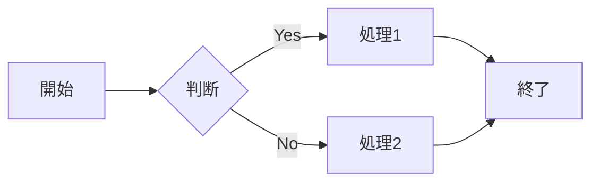

# デモ・サンプル

AutoSlideIdeaで作成されたプレゼンテーションの実例を紹介します。

## サンプルプレゼンテーション

<a href="{{ site.baseurl }}/demos/sample-presentation/" class="btn btn-primary" target="_blank">
  サンプルプレゼンテーションを見る →
</a>

### 収録サンプル

1. **基本的な例** - シンプルなプレゼンテーションの構成
2. **ビジネス提案** - 企業向けプレゼンテーションのサンプル
3. **技術プレゼン** - エンジニア向けの技術発表例

## テンプレートギャラリー

利用可能なテンプレートの一覧：

### ビジネス向け
- **business** - ビジネスプレゼンテーション用
- **pitch** - スタートアップピッチ用
- **report** - 報告書・レポート用

### 技術向け
- **technical** - 技術プレゼンテーション用
- **academic** - 学術発表用
- **workshop** - ワークショップ・ハンズオン用

### 汎用
- **basic** - 基本テンプレート
- **minimal** - ミニマルデザイン
- **modern** - モダンデザイン

## 作成例

### Markdownソース

```markdown
---
marp: true
theme: default
paginate: true
---

# プレゼンテーションタイトル

発表者名
2024年7月6日

---

# アジェンダ

1. 導入
2. 本題
3. まとめ

---

# 導入

ここに内容を記述...
```

### 生成されるスライド

上記のMarkdownから、美しくフォーマットされたHTMLプレゼンテーションが生成されます。

## カスタマイズ例

### カスタムCSS

```css
/* theme/custom.css */
section {
  background: linear-gradient(to bottom right, #667eea 0%, #764ba2 100%);
  color: white;
}

h1 {
  color: #ffd89b;
  text-shadow: 2px 2px 4px rgba(0,0,0,0.3);
}
```

### Mermaid図表

```markdown

```

## 関連ページ

- [基本的な使い方](../user-guide/basic-usage/)
- [テーマの使い方](../user-guide/themes/)
- [テンプレート一覧](../reference/templates/)