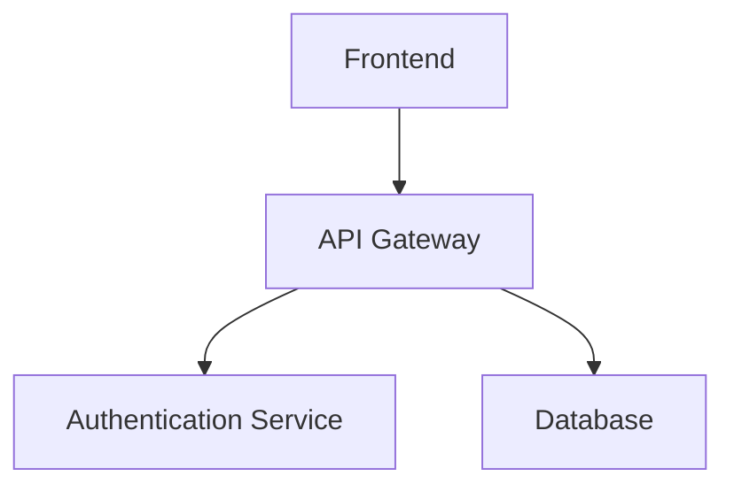
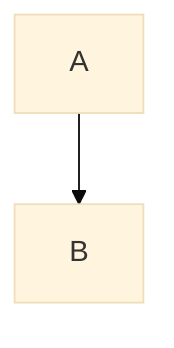

[English](mermaid.en.md) | [日本語](mermaid.md)

# Mermaid Diagram Integration Guide

## Overview

AutoSlideIdea provides a comprehensive solution for integrating Mermaid diagrams into Marp presentations. While Marp currently doesn't have direct support for Mermaid, our preprocessing approach enables seamless integration.

## Quick Start

### 1. Environment Setup
```bash
# Install Mermaid CLI (included in package.json)
npm install
```

### 2. Basic Usage
```bash
# Process a single file
./scripts/preprocess-mermaid.sh presentations/my-presentation/slides.md

# Build with Marp
npm run pdf -- presentations/my-presentation/slides-processed.md
```

### 3. Batch Processing Multiple Files
```bash
./scripts/batch-preprocess-mermaid.sh presentations/**/*.md
```

## Writing Mermaid Code

Use standard Mermaid notation within your Markdown files:

```markdown
## System Architecture


```

After processing, it will be automatically converted to an SVG image.

## Supported Diagram Types

- **Flowchart** (graph/flowchart)
- **Sequence Diagram** (sequenceDiagram)
- **Gantt Chart** (gantt)
- **Class Diagram** (classDiagram)
- **State Diagram** (stateDiagram)
- **Pie Chart** (pie)
- **ER Diagram** (erDiagram)
- **User Journey** (journey)

For detailed usage examples, see the [demo presentation](https://dobachi.github.io/AutoSlideIdea/).

## GitHub Actions Integration

### Setting Up Automatic Builds

1. Copy the workflow file:
```bash
cp templates/github-workflows/mermaid-enabled.yml .github/workflows/build-presentation.yml
```

2. Commit & push for automatic execution:
- Automatic detection and processing of Mermaid diagrams
- Japanese font support
- Automatic generation of PDF/HTML/PPTX
- Automatic GitHub Pages deployment

## Advanced Usage

### Applying Custom Themes
```bash
# Default theme
./scripts/preprocess-mermaid.sh -t default slides.md

# Dark theme
./scripts/preprocess-mermaid.sh -t dark slides.md
```

### Specifying Output Format
```bash
# PNG format (improved print quality)
./scripts/preprocess-mermaid.sh -f png slides.md

# PDF format (vector format)
./scripts/preprocess-mermaid.sh -f pdf slides.md
```

### Adjusting Image Size
```bash
# Specify width and height
./scripts/preprocess-mermaid.sh -w 800 -H 600 slides.md

# Adjust with scale
./scripts/preprocess-mermaid.sh -s 2 slides.md
```

## Troubleshooting

### Japanese Text Not Displaying

Japanese fonts are automatically installed in the GitHub Actions environment. For local environments:

```bash
# Ubuntu/Debian
sudo apt-get install fonts-noto-cjk

# macOS
brew install font-noto-sans-cjk
```

### Puppeteer Errors (CI Environment)

Sandbox errors in CI environments are handled automatically. For manual configuration:

```json
// puppeteer-config.json
{
  "args": ["--no-sandbox", "--disable-setuid-sandbox"]
}
```

### Diagrams Too Large/Small

1. Adjust in Mermaid configuration:


2. Adjust with script options:
```bash
./scripts/preprocess-mermaid.sh -s 1.5 slides.md  # Scale up by 1.5x
```

## Script Reference

### preprocess-mermaid.sh

Processes Mermaid diagrams in a single file.

**Options:**
- `-t, --theme`: Mermaid theme (default/dark/forest/neutral)
- `-b, --background`: Background color (default: transparent)
- `-f, --format`: Output format (svg/png/pdf)
- `-w, --width`: Image width
- `-H, --height`: Image height
- `-s, --scale`: Scale factor
- `-c, --config`: Custom configuration file
- `-o, --output`: Output directory

### batch-preprocess-mermaid.sh

Batch processes multiple files.

**Options:**
- `-p, --preserve-structure`: Preserve directory structure
- `-d, --output-dir`: Output directory
- `-n, --dry-run`: Dry run mode
- `--parallel`: Enable parallel processing

## Technical Implementation Details

### Why Preprocessing is Necessary

1. **Marp Constraints**: Issues with font size detection in SVG foreignObject
2. **Security**: Avoid dynamic script execution
3. **Performance**: Process only once at build time
4. **Compatibility**: Display correctly in PDF/PPTX exports

### Processing Flow

1. Detect Mermaid code blocks in Markdown files
2. Extract each block to a temporary file
3. Convert to images using Mermaid CLI
4. Replace original code blocks with image references
5. Output processed file

## Related Resources

- [Mermaid Official Documentation](https://mermaid.js.org/)
- [Marp Official Documentation](https://marp.app/)
- [Demo Presentation](https://dobachi.github.io/AutoSlideIdea/)
- [GitHub - mermaid-cli](https://github.com/mermaid-js/mermaid-cli)