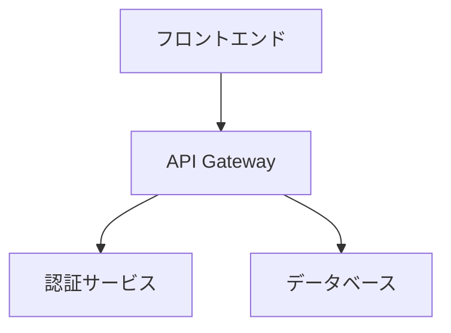

# Mermaid図表のMarpプレゼンテーションへの統合方法

## 概要

Marpには現在、Mermaidの直接的なサポートがありません。これは技術的な制約（SVG foreignObject内でのフォントサイズ検出の問題）とセキュリティ上の理由によるものです。しかし、いくつかの実用的な回避策があります。

## 統合方法

### 1. プリプロセッシング方式（推奨）

Mermaid CLIを使用して、MarkdownファイルのMermaidコードブロックを事前にSVG画像に変換する方法です。

#### 必要なツール
```bash
# Mermaid CLIのインストール
npm install -g @mermaid-js/mermaid-cli
```

#### 基本的な使用方法
```bash
# Mermaidブロックを含むMarkdownを処理
mmdc -i slides.md -o slides-processed.md
```

これにより、Mermaidコードブロックが自動的にSVG画像への参照に置き換えられます。

#### 処理前後の例

**処理前（slides.md）:**
```markdown
## システムアーキテクチャ


```

**処理後（slides-processed.md）:**
```markdown
## システムアーキテクチャ


```

### 2. プリプロセッシングスクリプト

以下は、Marp用のプリプロセッシングスクリプトの例です：

```bash
#!/bin/bash
# scripts/preprocess-mermaid.sh

set -e

# 引数チェック
if [ $# -eq 0 ]; then
    echo "Usage: $0 <input-markdown-file> [output-directory]"
    exit 1
fi

INPUT_FILE="$1"
OUTPUT_DIR="${2:-.}"
BASENAME=$(basename "$INPUT_FILE" .md)
OUTPUT_FILE="${OUTPUT_DIR}/${BASENAME}-processed.md"

# 出力ディレクトリ作成
mkdir -p "$OUTPUT_DIR"

# Mermaidブロックの存在確認（パフォーマンス向上のため）
if ! grep -q '```mermaid' "$INPUT_FILE"; then
    echo "No mermaid blocks found, copying file as is"
    cp "$INPUT_FILE" "$OUTPUT_FILE"
    exit 0
fi

# Mermaidブロックを処理
echo "Processing Mermaid diagrams in $INPUT_FILE..."
mmdc -i "$INPUT_FILE" -o "$OUTPUT_FILE" \
     --theme default \
     --backgroundColor white \
     --width 1280 \
     --height 720

if [ $? -eq 0 ]; then
    echo "✓ Successfully processed to: $OUTPUT_FILE"
    echo "Generated SVG files:"
    ls -la "${OUTPUT_DIR}/${BASENAME}-"*.svg 2>/dev/null || true
else
    echo "✗ Error processing file with mmdc"
    exit 1
fi
```

### 3. GitHub Actions統合

GitHub Actionsワークフローに統合する例：

```yaml
# .github/workflows/build-with-mermaid.yml
name: Build Presentation with Mermaid

on:
  push:
    branches: [main]
    paths:
      - '**.md'
      - '.github/workflows/*.yml'

jobs:
  build:
    runs-on: ubuntu-latest
    
    steps:
      - name: Checkout repository
        uses: actions/checkout@v4
        
      - name: Setup Node.js
        uses: actions/setup-node@v4
        with:
          node-version: '18'
          
      - name: Install dependencies
        run: |
          # Marp CLI
          npm install -g @marp-team/marp-cli
          
          # Mermaid CLI
          npm install -g @mermaid-js/mermaid-cli
          
          # 日本語フォント（Mermaidでも使用）
          sudo apt-get update
          sudo apt-get install -y fonts-noto-cjk fonts-noto-emoji
          
      - name: Preprocess Mermaid diagrams
        run: |
          mkdir -p processed
          
          # すべてのMarkdownファイルを処理
          for md in $(find presentations -name "*.md" -type f); do
            echo "Processing: $md"
            
            # 出力パスを計算
            relative_path=$(realpath --relative-to=presentations "$md")
            output_dir="processed/$(dirname "$relative_path")"
            mkdir -p "$output_dir"
            
            # Mermaidを処理
            mmdc -i "$md" -o "$output_dir/$(basename "$md")" \
                 --theme default \
                 --backgroundColor transparent
          done
          
      - name: Build presentations
        run: |
          mkdir -p dist/{pdf,html}
          
          # 処理済みファイルからPDFとHTMLを生成
          for md in $(find processed -name "*.md" -type f); do
            filename=$(basename "$md" .md)
            output_base="dist/$(dirname $(realpath --relative-to=processed "$md"))"
            
            mkdir -p "$output_base/pdf" "$output_base/html"
            
            marp "$md" --pdf --allow-local-files \
                 -o "$output_base/pdf/${filename}.pdf"
            marp "$md" --html --allow-local-files \
                 -o "$output_base/html/${filename}.html"
          done
          
      - name: Upload artifacts
        uses: actions/upload-artifact@v4
        with:
          name: presentations-${{ github.sha }}
          path: dist/
```

### 4. 高度な統合オプション

#### A. Krokiサービスの使用

Kroki.ioを使用して、様々な図表形式（Mermaidを含む）をレンダリングする方法：

```javascript
// engine.js - Marp CLIでカスタムエンジンを使用
module.exports = ({ marp }) => {
  // markdown-it-krokiプラグインを使用
  const markdownItKroki = require('@kazumatu981/markdown-it-kroki');
  
  return marp.use(markdownItKroki, {
    server: 'https://kroki.io',
    mermaidOptions: {
      theme: 'default'
    }
  });
};
```

使用例：
```bash
marp --engine ./engine.js slides.md
```

#### B. ブラウザでの動的レンダリング（HTMLエクスポート時のみ）

HTMLエクスポート時にMermaidを動的にレンダリングする方法：

```markdown
---
marp: true
---

<!-- Mermaidスクリプトを含める -->
<script type="module">
import mermaid from 'https://cdn.jsdelivr.net/npm/mermaid@10/dist/mermaid.esm.min.mjs';
mermaid.initialize({ 
  startOnLoad: true,
  theme: 'default',
  themeVariables: {
    fontSize: '16px'
  }
});
</script>

# フローチャートの例

<div class="mermaid">
graph TD
  A[開始] --> B{条件分岐}
  B -->|Yes| C[処理1]
  B -->|No| D[処理2]
  C --> E[終了]
  D --> E
</div>
```

**注意**: この方法はPDFエクスポートでは機能しません。

### 5. ベストプラクティス

1. **図表のサイズ管理**
   ```bash
   # 適切なサイズを指定
   mmdc -i input.md -o output.md --width 1920 --height 1080
   ```

2. **テーマの統一**
   ```bash
   # Marpのテーマに合わせた背景色
   mmdc -i input.md -o output.md --backgroundColor transparent
   ```

3. **キャッシュの活用**
   ```bash
   # 変更されたファイルのみ処理
   if [ "$INPUT_FILE" -nt "$OUTPUT_FILE" ]; then
     mmdc -i "$INPUT_FILE" -o "$OUTPUT_FILE"
   fi
   ```

4. **エラーハンドリング**
   ```bash
   # Mermaid構文エラーの検出
   if ! mmdc -i "$INPUT_FILE" -o "$OUTPUT_FILE" 2>error.log; then
     echo "Mermaid syntax error in $INPUT_FILE:"
     cat error.log
     exit 1
   fi
   ```

### 6. 複数ファイル処理スクリプト

```bash
#!/bin/bash
# scripts/batch-preprocess-mermaid.sh

set -e

# デフォルト設定
THEME="default"
BG_COLOR="transparent"
WIDTH=1920
HEIGHT=1080
OUTPUT_DIR="processed"

# 使用方法を表示
usage() {
    cat << EOF
Usage: $0 [options] <markdown-files...>

Options:
  -t <theme>     Mermaid theme (default, forest, dark, neutral)
  -b <color>     Background color (default: transparent)
  -w <width>     Diagram width (default: 1920)
  -h <height>    Diagram height (default: 1080)
  -o <dir>       Output directory (default: processed)
  --help         Show this help

Example:
  $0 -t dark -o output presentations/**/*.md
EOF
}

# オプション解析
while [[ $# -gt 0 ]]; do
    case $1 in
        -t|--theme)
            THEME="$2"
            shift 2
            ;;
        -b|--background)
            BG_COLOR="$2"
            shift 2
            ;;
        -w|--width)
            WIDTH="$2"
            shift 2
            ;;
        -h|--height)
            HEIGHT="$2"
            shift 2
            ;;
        -o|--output)
            OUTPUT_DIR="$2"
            shift 2
            ;;
        --help)
            usage
            exit 0
            ;;
        -*)
            echo "Unknown option: $1"
            usage
            exit 1
            ;;
        *)
            break
            ;;
    esac
done

# ファイルが指定されているか確認
if [ $# -eq 0 ]; then
    echo "Error: No input files specified"
    usage
    exit 1
fi

# 出力ディレクトリ作成
mkdir -p "$OUTPUT_DIR"

# 各ファイルを処理
total=$#
current=0
errors=0

for file in "$@"; do
    ((current++))
    
    if [ ! -f "$file" ]; then
        echo "[$current/$total] ⚠️  File not found: $file"
        ((errors++))
        continue
    fi
    
    # 相対パスを維持して出力
    relative_dir=$(dirname "$file")
    basename=$(basename "$file")
    output_subdir="$OUTPUT_DIR/$relative_dir"
    output_file="$output_subdir/$basename"
    
    mkdir -p "$output_subdir"
    
    # Mermaidブロックの存在確認
    if ! grep -q '```mermaid' "$file"; then
        echo "[$current/$total] →  No mermaid blocks in: $file (copying)"
        cp "$file" "$output_file"
        continue
    fi
    
    echo "[$current/$total] 🔄 Processing: $file"
    
    # Mermaid処理
    if mmdc -i "$file" -o "$output_file" \
            --theme "$THEME" \
            --backgroundColor "$BG_COLOR" \
            --width "$WIDTH" \
            --height "$HEIGHT" 2>/dev/null; then
        echo "[$current/$total] ✅ Success: $output_file"
    else
        echo "[$current/$total] ❌ Failed: $file"
        ((errors++))
    fi
done

# 結果サマリー
echo ""
echo "========================================="
echo "Processing complete!"
echo "Total files: $total"
echo "Errors: $errors"
echo "Output directory: $OUTPUT_DIR"
echo "========================================="

exit $errors
```

### 7. トラブルシューティング

#### 問題: 日本語が文字化けする
```bash
# フォント設定を含むconfig.json
cat > mermaid-config.json << EOF
{
  "theme": "default",
  "themeVariables": {
    "fontFamily": "Noto Sans CJK JP, sans-serif"
  }
}
EOF

mmdc -i input.md -o output.md -c mermaid-config.json
```

#### 問題: SVGが大きすぎる
```css
/* カスタムCSS (custom.css) */
.mermaid svg {
  max-width: 100%;
  height: auto;
}
```

```bash
mmdc -i input.md -o output.md --cssFile custom.css
```

#### 問題: PDFで図が切れる
```bash
# PDFフォーマットで直接出力
mmdc -i diagram.mmd -o diagram.pdf -f pdf
```

## まとめ

MarpでMermaidを使用する最も信頼性の高い方法は、プリプロセッシングアプローチです。これにより：

1. ✅ PDFエクスポートでも動作
2. ✅ 一貫した表示品質
3. ✅ CI/CDパイプラインに統合可能
4. ✅ エラーの事前検出が可能

プロジェクトの要件に応じて、適切な統合方法を選択してください。