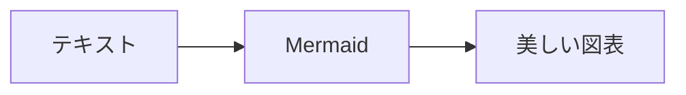
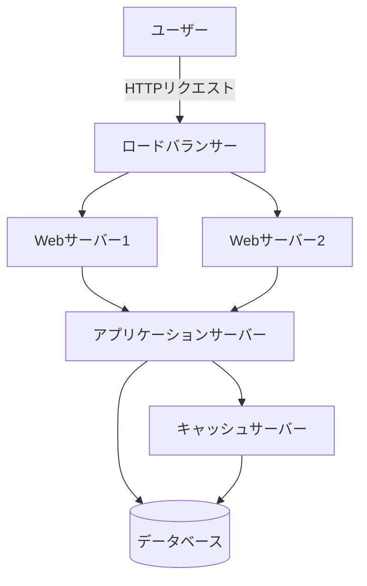
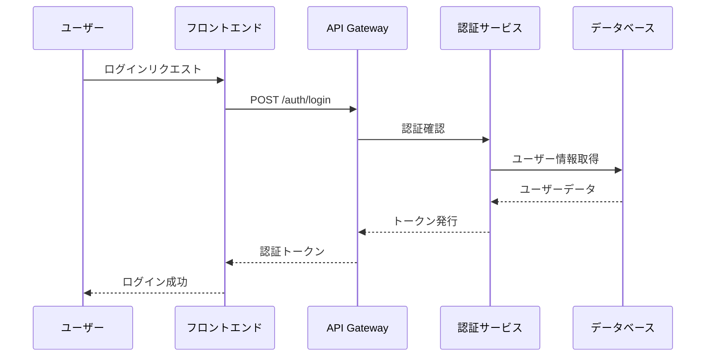
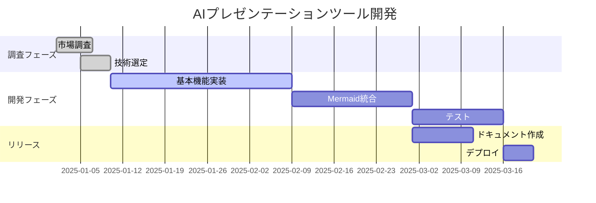
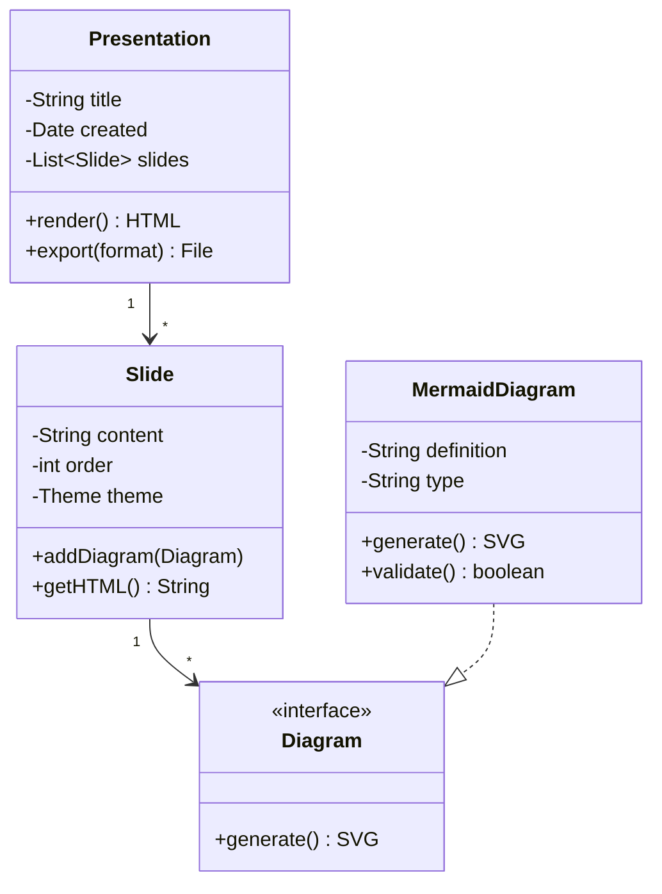
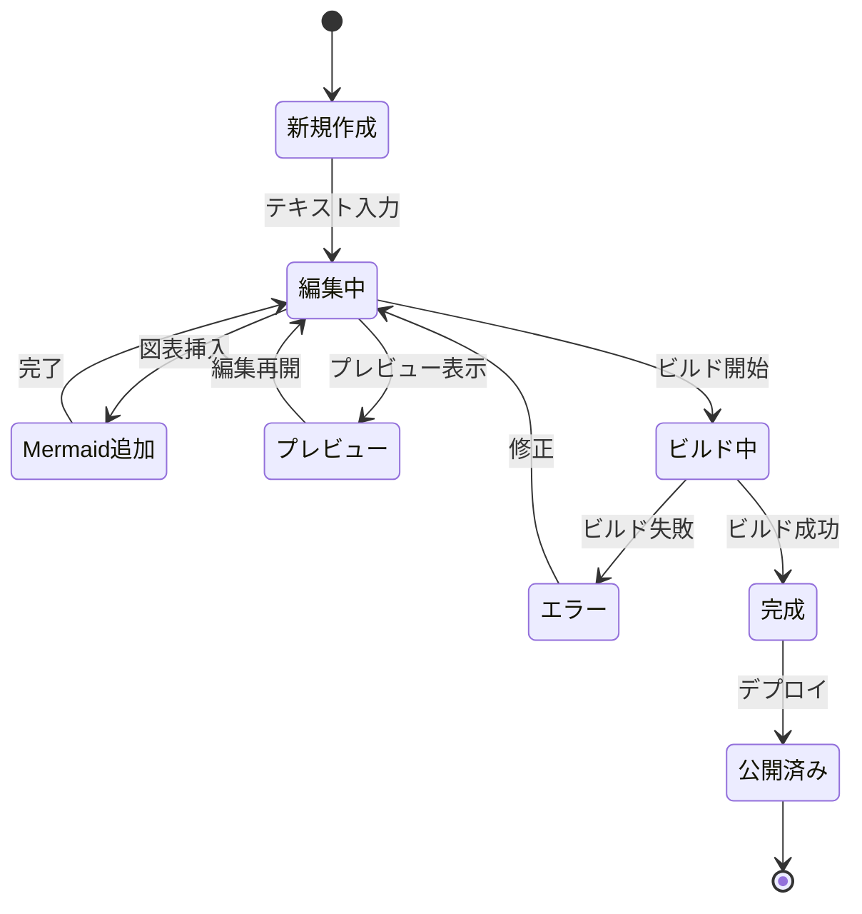
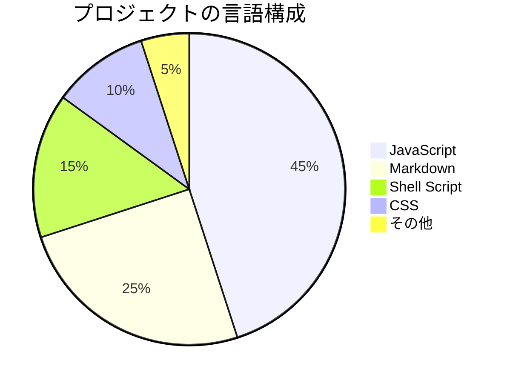
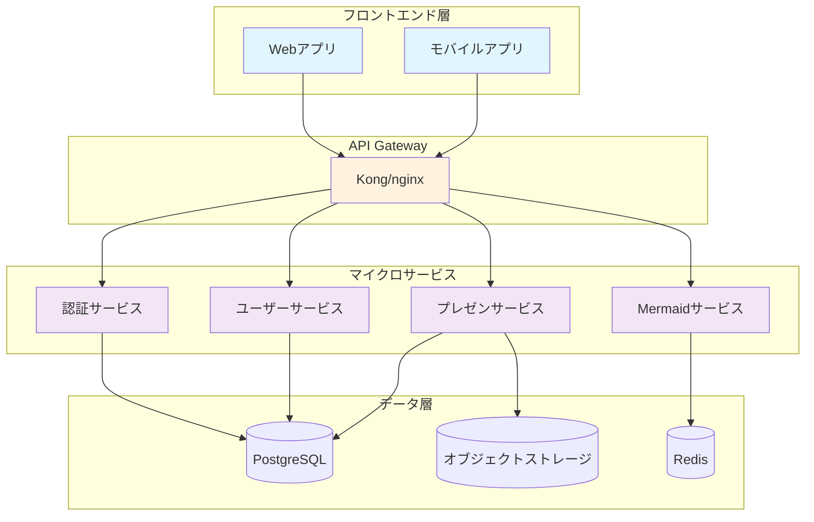

<!-- _class: title -->

# Mermaid図表の統合デモ

## Marpプレゼンテーションでの図表活用

技術デモンストレーション
2025年1月

---

# アジェンダ

1. Mermaidとは？
2. フローチャート
3. シーケンス図
4. ガントチャート
5. クラス図
6. 状態遷移図
7. 円グラフ
8. まとめ

---

# Mermaidとは？

- **テキストベース**の図表作成ツール
- **バージョン管理**に適している
- **多様な図表形式**をサポート
- **自動レイアウト**で美しい図表を生成



---

# フローチャートの例

## システムアーキテクチャ



---

# シーケンス図

## API通信フロー



---

# ガントチャート

## プロジェクトスケジュール



---

# クラス図

## システム設計



---

# 状態遷移図

## プレゼンテーション作成フロー



---

# 円グラフ

## 技術スタック構成



---

# より複雑な例

## マイクロサービスアーキテクチャ



---

# 統合のメリット

## なぜMermaidをMarpに統合するのか？

| メリット | 説明 |
|---------|------|
| **保守性** | テキストベースで管理可能 |
| **一貫性** | スタイルの統一が容易 |
| **自動化** | CI/CDでの自動生成 |
| **協業** | レビューが簡単 |
| **更新** | 図表の更新が即座に反映 |

---

# 実装方法

## 3つのアプローチ

1. **プリプロセッシング** ✅ 推奨
   - `mermaid-cli`で事前変換
   - 最も安定した方法

2. **Krokiサービス**
   - 外部サービスでレンダリング
   - ネットワーク依存

3. **ブラウザレンダリング**
   - HTMLのみ対応
   - PDFでは使用不可

---

<!-- _class: title -->

# まとめ

## Mermaid × Marp = 🚀

- **図表とスライドの統合管理**
- **バージョン管理に優しい**
- **自動化で効率アップ**
- **美しいプレゼンテーション**

### 今すぐ始めよう！

```bash
npm install -g @mermaid-js/mermaid-cli
./scripts/preprocess-mermaid.sh slides.md
```