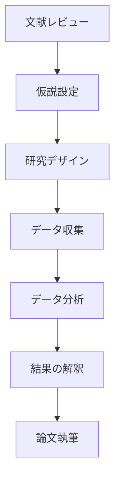
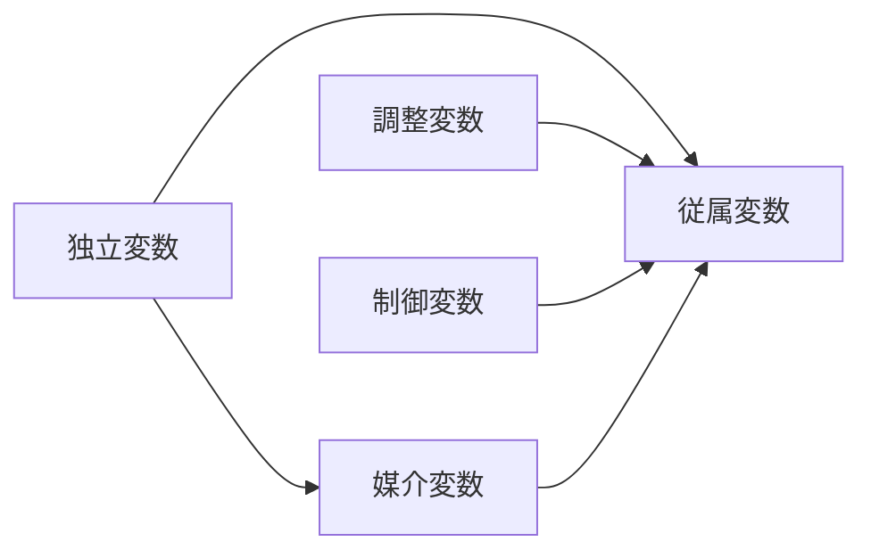

# 学術研究発表プレゼンテーション作成ガイド

## 目的
研究成果を学術コミュニティに対して論理的かつ説得力を持って発表します。

## 構成の指針

### 1. タイトルスライド
- 研究タイトル
- 著者名・共著者名
- 所属機関
- 学会名・日付

### 2. 研究背景
- 研究分野の概要
- 既存研究のレビュー
- 研究の動機
- 解決したい問題

### 3. 研究目的・仮説
- 明確な研究目的
- 検証する仮説
- 研究の新規性
- 期待される貢献

### 4. 理論的枠組み
- 基礎となる理論
- 概念モデル
- 用語の定義

### 5. 研究方法
- 研究デザイン
- データ収集方法
- 分析手法
- 倫理的配慮

### 6. 結果
- 主要な発見
- データの視覚化
- 統計的有意性
- 予期しない結果

### 7. 考察
- 結果の解釈
- 理論への貢献
- 実務への示唆
- 研究の限界

### 8. 結論
- 主要な発見の要約
- 研究目的の達成度
- 今後の研究課題

### 9. 参考文献
- 主要な引用文献
- 追加資料

### 10. 謝辞・質疑応答
- 研究支援への感謝
- 連絡先
- 質問への準備

## スタイルガイド

### 文章
- 学術的な正確性
- 専門用語の適切な使用
- 論理的な流れ
- 客観的な表現

### ビジュアル
- データの適切な視覚化
- 統計グラフの活用
- 概念図・フローチャート
- 控えめな配色

### Mermaid図の活用例

#### 研究フロー

#### 概念モデル

## 注意点
- 時間厳守（通常15-20分）
- 先行研究への適切な言及
- 統計的厳密性の確保
- 限界と今後の課題を明確に
- 質疑応答への十分な準備
- スライドの情報量は適度に