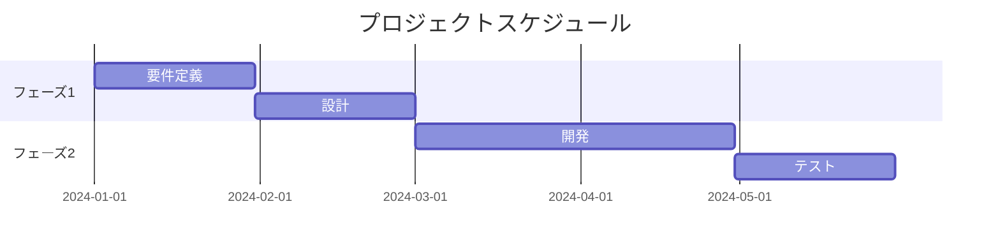
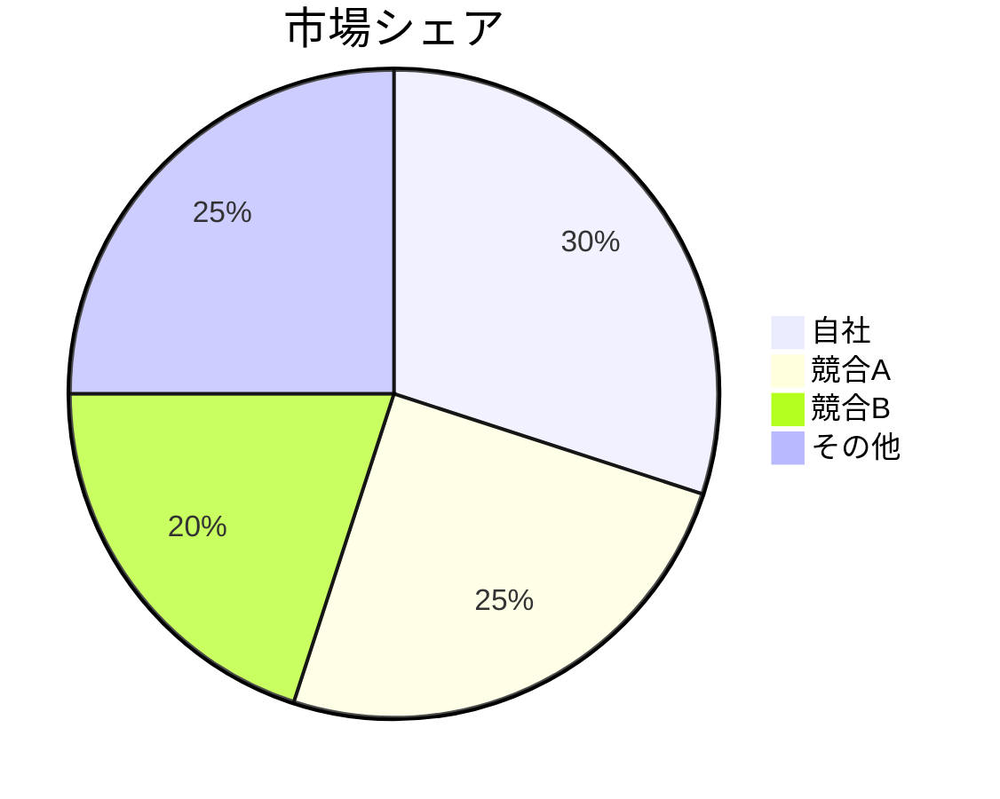

# ビジネス提案プレゼンテーション作成ガイド

## 目的
ビジネスの意思決定者に対して、提案の価値を明確に伝え、承認や投資を獲得します。

## 構成の指針

### 1. タイトルスライド
- 提案のタイトル
- 会社名/部署名
- 発表者名
- 日付

### 2. エグゼクティブサマリー
- 提案の要点（3-4行）
- 期待される成果
- 必要な投資/リソース

### 3. 現状分析
- 市場の状況
- 競合分析
- 自社の位置づけ
- 解決すべき課題

### 4. 提案の概要
- ソリューションの説明
- 独自性・差別化要因
- 実現可能性

### 5. ビジネスモデル
- 収益構造
- コスト構造
- ターゲット顧客
- 価値提案

### 6. 実施計画
- タイムライン（Mermaidガントチャート推奨）
- マイルストーン
- 必要なリソース
- チーム構成

### 7. 財務予測
- 売上予測
- コスト見積もり
- ROI/投資回収期間
- リスクと対策

### 8. 成功事例/実績
- 類似プロジェクトの成果
- 顧客の声
- 実績データ

### 9. 次のステップ
- 承認後のアクション
- 必要な意思決定
- スケジュール

### 10. 付録
- 詳細データ
- 参考資料
- 連絡先

## スタイルガイド

### 文章
- 簡潔で明確なメッセージ
- 数字やデータで裏付け
- ビジネス用語は適切に使用

### ビジュアル
- グラフやチャートを活用
- インフォグラフィックス
- ブランドカラーの使用

### Mermaid図の活用例

#### ガントチャート

#### 円グラフ

## 注意点
- ROIを明確に示す
- リスクも正直に伝える
- 意思決定者の関心事にフォーカス
- 時間は厳守（通常15-20分）
- 質疑応答の準備を万全に