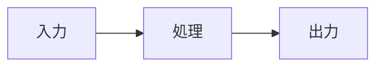
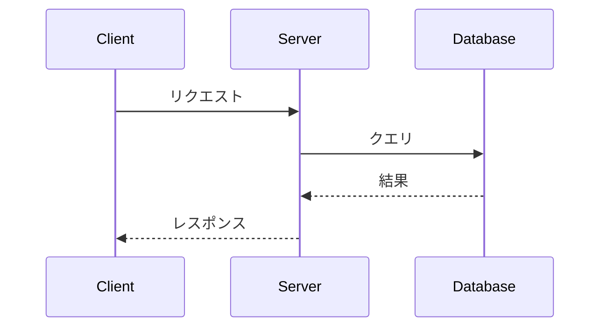

# 技術プレゼンテーション作成ガイド

## 目的
技術的な内容を聴衆に分かりやすく伝えるプレゼンテーションを作成します。

## 構成の指針

### 1. タイトルスライド
- プレゼンテーションのタイトル
- 発表者名・所属
- 日付
- 必要に応じてロゴ

### 2. アジェンダ/目次
- 3-5個の主要トピック
- 各セクションの簡潔な説明

### 3. 背景・課題
- なぜこの技術が必要なのか
- 解決したい問題は何か
- 現状の課題や制限

### 4. 技術の概要
- 基本的なコンセプト
- アーキテクチャ図（Mermaid推奨）
- 主要な特徴

### 5. 実装の詳細
- 重要な技術的決定
- コード例（シンタックスハイライト付き）
- パフォーマンス指標

### 6. デモ/実例
- 実際の動作例
- スクリーンショットや図
- 使用方法の説明

### 7. 利点と制限
- メリット
- デメリット
- 適用範囲

### 8. 今後の展望
- ロードマップ
- 改善予定
- コミュニティへの貢献方法

### 9. まとめ
- 重要ポイントの再確認
- Call to Action

### 10. 質疑応答
- 連絡先
- リソースへのリンク
- Q&Aスライド

## スタイルガイド

### 文章
- 専門用語は最初に説明
- 箇条書きを活用（3-5項目）
- 1スライド1トピック

### ビジュアル
- コード例は短く分かりやすく
- 図表を積極的に使用
- 配色は見やすさ重視

### Mermaid図の活用例

## 注意点
- 技術的に正確であること
- 聴衆のレベルに合わせる
- デモは必ず事前にテスト
- 時間配分を考慮（通常20-30分）